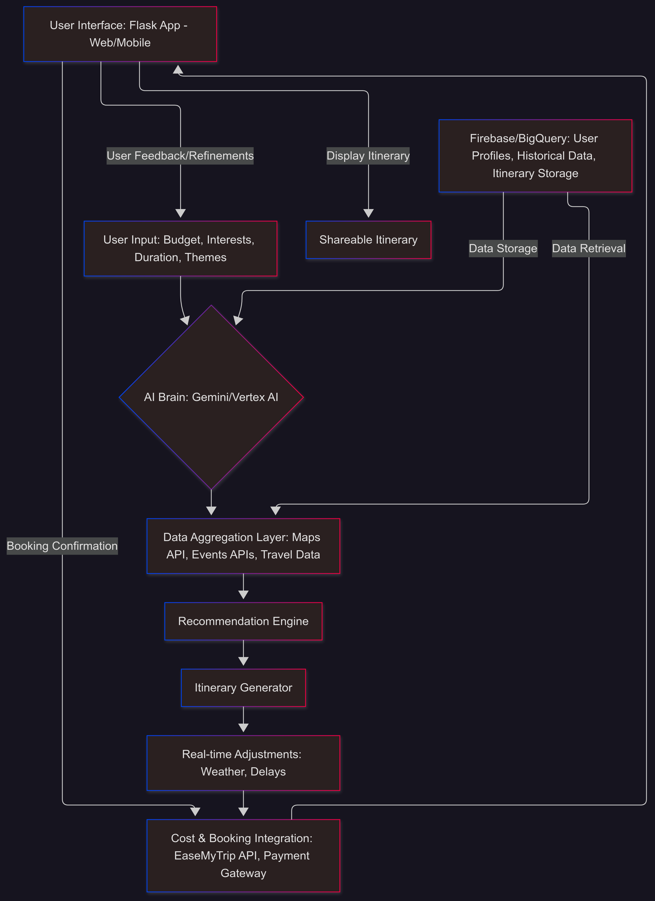
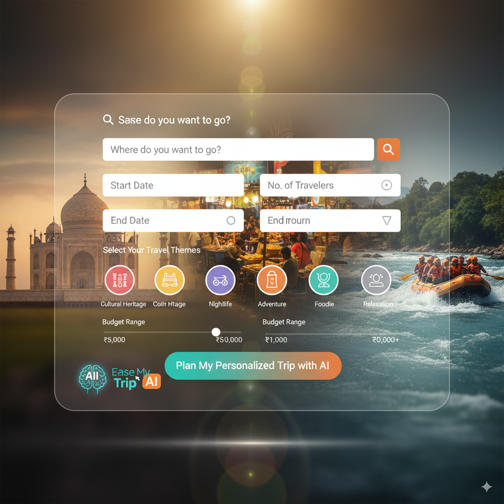

# Trip Planner Hackathon

## Table of Contents
1. [Core Architecture & Data Flow](#core-architecture--data-flow)
2. [Solution Capabilities & Tech Stack](#solution-capabilities--tech-stack)
    - [Generate Dynamic Itineraries](#generate-dynamic-itineraries)
    - [Aggregate Data from Multiple Sources](#aggregate-data-from-multiple-sources)
    - [Multilingual, Interactive Interfaces](#multilingual-interactive-interfaces)
    - [Smart Adjustments in Real-Time](#smart-adjustments-in-real-time)
    - [Deliver Shareable, Optimized Itinerary & Booking](#deliver-shareable-optimized-itinerary--booking)
3. [Google Cloud Specifics](#google-cloud-specifics)
4. [Tech Stack Overview](#tech-stack-overview)
5. [Development Steps](#development-steps)
6. [Visualizing the User Flow](#visualizing-the-user-flow)

---

## 1. Core Architecture & Data Flow

At a high level, the system involves several interconnected components:



---

## 2. Solution Capabilities & Tech Stack

### Generate Dynamic Itineraries

- **User Input:**
    - A **Flask Frontend** web form captures preferences like destination, travel dates, budget, number of travelers, interests (e.g., cultural heritage, nightlife, adventure), and desired pace.
    - Example UI:
      

- **AI Engine (Gemini/Vertex AI):**
    - Uses prompt engineering to generate personalized itineraries. Example prompt:
      > "Generate a 5-day itinerary for a solo traveler in Goa with a moderate budget (~₹25,000), focusing on adventure sports and nightlife. Include accommodation suggestions, transport between activities, and approximate costs."
    - Outputs a structured JSON itinerary:
      ```json
      {
          "trip_id": "TRP001",
          "destination": "Goa",
          "start_date": "2024-10-20",
          "end_date": "2024-10-24",
          "total_budget": 25000,
          "itinerary": [
              {
                  "day": 1,
                  "activities": [
                      {"time": "09:00", "description": "Arrival at Goa Airport", "cost": 800},
                      {"time": "15:00", "description": "Parasailing at Baga Beach", "cost": 2500}
                  ]
              }
          ]
      }
      ```

### Aggregate Data from Multiple Sources

- **Google Maps API:**
    - **Places API:** Fetch points of interest (POIs), restaurants, hotels.
    - **Directions API:** Calculate travel times and distances.
    - **Geocoding API:** Convert addresses to coordinates.

- **BigQuery:** Store curated travel data, including POIs, accommodations, transport options, and historical pricing.

### Multilingual, Interactive Interfaces

- **Flask Frontend:** Use Jinja2 templates for dynamic HTML pages.
- **Multilingual Support:** Add `flask-babel` for localization.

### Smart Adjustments in Real-Time

- **Weather API Integration:** Adjust itineraries based on weather conditions.
- **Traffic Updates:** Use Google Maps Directions API for real-time traffic data.
- **Last-Minute Availability:** Re-check availability and prices using EaseMyTrip API.

### Deliver Shareable, Optimized Itinerary & Booking

- **Optimization:** Minimize travel time between points using Google Maps Distance Matrix API.
- **Shareable Itineraries:** Generate unique URLs or downloadable PDFs.
- **Booking Integration:** Use EaseMyTrip API for real-time bookings and integrate a secure payment gateway.

---

## 3. Google Cloud Specifics

- **Gemini:** Leverage Gemini for natural language understanding and itinerary generation.
- **Vertex AI:** Deploy custom models and manage AI workflows.
- **Firebase:**
    - Authentication for user login/signup.
    - Firestore for storing user profiles and itineraries.
- **BigQuery:** Store and analyze large datasets for POIs, user interactions, and analytics.

---

## 4. Tech Stack Overview

- **Backend:** Python, Flask
- **Frontend:** HTML, CSS, JavaScript (Bootstrap, Jinja2)
- **APIs:** Google Maps API, EaseMyTrip API, Weather API
- **Database:** Firebase Firestore, BigQuery
- **AI:** Gemini (via Vertex AI)
- **PDF Generation:** `ReportLab` or `Fpdf`
- **Deployment:** Google Cloud Run, Firebase Hosting

---

## 5. Development Steps

1. **Set up Google Cloud Project:** Enable APIs (Gemini, Maps, Firebase, BigQuery).
2. **Build Flask App:** Create a basic app with user authentication and input forms.
3. **Integrate AI:** Use Gemini for itinerary generation.
4. **Connect APIs:** Fetch POIs, calculate routes, and integrate EaseMyTrip for bookings.
5. **Optimize Itineraries:** Minimize travel time and adjust for real-time conditions.
6. **Add Multilingual Support:** Use `flask-babel` for localization.
7. **Deploy Application:** Use Firebase Hosting and Google Cloud Run.

---

## 6. Visualizing the User Flow

The user flow involves:
1. Inputting preferences via the web form.
2. Generating a dynamic itinerary using AI.
3. Adjusting the itinerary in real-time based on conditions.
4. Finalizing bookings and sharing the itinerary.

---

This project leverages the power of AI and cloud technologies to deliver a personalized and dynamic travel planning experience.

